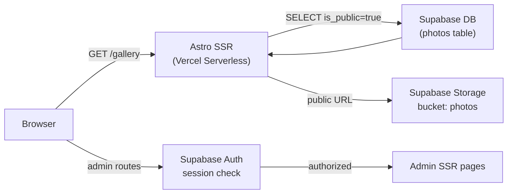

# PixelJourney — Copilot Instructions

Photography portfolio built with Astro 6, Supabase Storage and Supabase DB. Displays photos taken with mobile devices, organized in albums, with a focus on performance and visual quality. Includes a private admin panel to upload, edit and delete photos.

---

## Stack & Key Dependencies

| Concern | Tool |
|---|---|
| Framework | Astro 6 (`output: 'server'`) |
| Adapter | `@astrojs/vercel` |
| Photo Storage | Supabase Storage — bucket `photos` (public) |
| Database | Supabase DB — table `photos` |
| Auth | Supabase Auth (admin panel only) |
| Styles | Tailwind CSS v4 (`@tailwindcss/vite`) |
| Images | Vercel Image Optimization via `/_vercel/image` |
| Interactivity | Astro Islands — Preact for Lightbox only |
| Transitions | Astro View Transitions API |
| Language | TypeScript (strict mode — `astro/tsconfigs/strict`) |
| Linting | ESLint + Prettier |

> **Rule**: Do NOT add frameworks (React, Vue, Svelte) unless there is no way to achieve the result with Astro components or plain Web APIs.

---

## Architecture

### Output Mode

Use `output: 'server'`. All pages are SSR by default. Static pages opt-in with `export const prerender = true`.

Pages that are static:
- `index.astro` (homepage) — prerender

Pages that are SSR:
- `gallery/index.astro` — reads `is_public = true` photos from Supabase, groups by album
- `gallery/[album].astro` — photos filtered by album slug
- `photo/[id].astro` — photo detail using `large.webp`
- `admin/*.astro` — protected routes, check session server-side



### Data Flow — Public Gallery

1. Astro SSR page queries Supabase DB: `SELECT * FROM photos WHERE is_public = true ORDER BY taken_at DESC`.
2. For each photo, the public URL is derived from `storage_path` via the Supabase Storage public URL helper.
3. Grid renders `thumb.webp` variants. Lightbox opens `large.webp`.

### Data Flow — Admin Panel

1. Server middleware checks `supabase.auth.getUser()` on every `/admin/*` request.
2. Unauthenticated requests redirect to `/admin/login`.
3. Upload flow: client uploads the three image variants to Supabase Storage, then inserts a row in the `photos` table with the `storage_path` and metadata.

---

## Database Schema

```sql
-- Run in Supabase SQL Editor

CREATE TABLE photos (
  id           uuid PRIMARY KEY DEFAULT gen_random_uuid(),
  storage_path text        NOT NULL,  -- e.g. "uploads/abc-123" (no trailing slash)
  title        text,
  description  text,
  location     text,
  device       text,                  -- "iPhone 15 Pro", "Pixel 8 Pro", etc.
  taken_at     timestamptz,
  album        text        NOT NULL DEFAULT 'general',  -- album slug
  tags         text[]      NOT NULL DEFAULT '{}',
  is_public    boolean     NOT NULL DEFAULT false,
  width        int,
  height       int,
  created_at   timestamptz NOT NULL DEFAULT now(),
  updated_at   timestamptz NOT NULL DEFAULT now()
);

-- Index for gallery queries
CREATE INDEX photos_album_public_idx ON photos (album, is_public, taken_at DESC);

-- Row Level Security
ALTER TABLE photos ENABLE ROW LEVEL SECURITY;

-- Anyone can read public photos
CREATE POLICY "Public photos are viewable by everyone"
  ON photos FOR SELECT
  USING (is_public = true);

-- Only authenticated users (admin) can do everything
CREATE POLICY "Admin has full access"
  ON photos FOR ALL
  USING (auth.role() = 'authenticated');
```

---

## Supabase Storage Structure

```
Bucket: photos  (public)
└── uploads/
    └── {photo_id}/
        ├── thumb.webp      ← always required (max 640 px wide, q 80)
        ├── large.webp      ← always required (max 1920 px wide, q 85)
        └── original.jpg    ← optional, preserve original quality
```

- `storage_path` in DB = `"uploads/{photo_id}"` — NO trailing slash, NO filename.
- Derive file URLs by appending `/thumb.webp` or `/large.webp` to the public base URL.
- File names are fixed: `thumb.webp`, `large.webp`, `original.jpg`. Never vary them.
- Upload order: `thumb` first, then `large`, then `original` (optional).

### Deriving public URLs

```typescript
// src/lib/storage.ts
const STORAGE_BASE =
  `${import.meta.env.SUPABASE_URL}/storage/v1/object/public/photos`;

export function thumbUrl(storagePath: string): string {
  return `${STORAGE_BASE}/${storagePath}/thumb.webp`;
}

export function largeUrl(storagePath: string): string {
  return `${STORAGE_BASE}/${storagePath}/large.webp`;
}

export function originalUrl(storagePath: string): string {
  return `${STORAGE_BASE}/${storagePath}/original.jpg`;
}
```

---

## Project Structure

```
PixelJourney/
├── .github/
│   └── copilot-instructions.md       ← this file
├── public/
│   └── favicon.svg
├── src/
│   ├── components/
│   │   ├── layout/
│   │   │   ├── Header.astro
│   │   │   ├── Footer.astro
│   │   │   └── Navigation.astro
│   │   ├── photo/
│   │   │   ├── PhotoCard.astro       ← thumbnail + hover effect
│   │   │   ├── PhotoGrid.astro       ← CSS masonry grid
│   │   │   ├── AlbumCard.astro       ← album listing
│   │   │   └── Lightbox.tsx          ← Preact island, lazy-loaded
│   │   └── ui/
│   │       ├── Badge.astro
│   │       └── LoadingSpinner.astro
│   ├── layouts/
│   │   ├── BaseLayout.astro          ← <html>, meta, fonts, global styles
│   │   └── GalleryLayout.astro       ← extends BaseLayout, adds breadcrumb
│   ├── lib/
│   │   ├── supabase.ts               ← Supabase client (server + browser instances)
│   │   ├── photos.ts                 ← ALL DB queries go here
│   │   └── storage.ts                ← public URL helpers (thumbUrl, largeUrl)
│   ├── middleware/
│   │   └── index.ts                  ← auth guard for /admin/* routes
│   ├── pages/
│   │   ├── index.astro               ← prerender = true
│   │   ├── gallery/
│   │   │   ├── index.astro           ← albums listing (SSR)
│   │   │   └── [album].astro         ← photo grid per album (SSR)
│   │   ├── photo/
│   │   │   └── [id].astro            ← photo detail, uses large.webp (SSR)
│   │   └── admin/
│   │       ├── index.astro           ← dashboard (SSR, auth-protected)
│   │       ├── login.astro           ← login form (SSR)
│   │       ├── upload.astro          ← upload form (SSR, auth-protected)
│   │       └── photos/
│   │           └── [id]/
│   │               └── edit.astro    ← edit metadata (SSR, auth-protected)
│   ├── styles/
│   │   └── global.css
│   └── types/
│       └── photo.ts
├── astro.config.mjs
├── package.json
└── tsconfig.json
```

### Directory Rules

- **`src/lib/`** — Pure functions only. No Astro-specific imports. Testable in isolation.
- **`src/middleware/`** — Only for cross-cutting concerns (auth guard). One file.
- **`src/components/photo/`** — Components that understand the `Photo` domain type.
- **`src/components/ui/`** — Dumb, reusable primitives with no domain knowledge.
- **`src/components/layout/`** — Page-level structural components (Header, Footer, Nav).
- **`src/layouts/`** — Full page shells. Always used from `.astro` pages, never nested inside other components.
- **`src/types/`** — TypeScript interfaces exported and shared across the codebase.

---

## TypeScript Types

Define all shared types in `src/types/photo.ts`. Do NOT redeclare them inline.

```typescript
// src/types/photo.ts
export interface Photo {
  id: string;
  storagePath: string;       // e.g. "uploads/abc-123" — used to build URLs
  title: string | null;
  description: string | null;
  location: string | null;
  device: string | null;     // e.g. "iPhone 15 Pro", "Pixel 8 Pro"
  takenAt: Date | null;
  album: string;             // album slug, e.g. "landscapes"
  tags: string[];
  isPublic: boolean;
  width: number | null;
  height: number | null;
  createdAt: Date;
}

// Raw row returned from Supabase — snake_case from DB
export interface PhotoRow {
  id: string;
  storage_path: string;
  title: string | null;
  description: string | null;
  location: string | null;
  device: string | null;
  taken_at: string | null;
  album: string;
  tags: string[];
  is_public: boolean;
  width: number | null;
  height: number | null;
  created_at: string;
  updated_at: string;
}
```

---

## Supabase Client

All Supabase access goes through `src/lib/supabase.ts`. Never instantiate the client outside this file.

```typescript
// src/lib/supabase.ts
import { createClient } from '@supabase/supabase-js';

// Server-side client — uses the service role key, bypasses RLS
export const supabaseAdmin = createClient(
  import.meta.env.SUPABASE_URL,
  import.meta.env.SUPABASE_SERVICE_ROLE_KEY,
);

// Client-side / SSR client — uses the anon key, respects RLS
export const supabase = createClient(
  import.meta.env.SUPABASE_URL,
  import.meta.env.SUPABASE_ANON_KEY,
);
```

> **Rule**: Use `supabase` (anon) for all public queries. Use `supabaseAdmin` only in admin server routes where bypassing RLS is intentional.

---

## Data Access Layer

All DB queries go through `src/lib/photos.ts`. Never write inline Supabase queries in page frontmatter.

```typescript
// src/lib/photos.ts
import { supabase } from './supabase';
import type { Photo, PhotoRow } from '../types/photo';

function rowToPhoto(row: PhotoRow): Photo {
  return {
    id: row.id,
    storagePath: row.storage_path,
    title: row.title,
    description: row.description,
    location: row.location,
    device: row.device,
    takenAt: row.taken_at ? new Date(row.taken_at) : null,
    album: row.album,
    tags: row.tags,
    isPublic: row.is_public,
    width: row.width,
    height: row.height,
    createdAt: new Date(row.created_at),
  };
}

export async function getPublicPhotos(): Promise<Photo[]> {
  const { data, error } = await supabase
    .from('photos')
    .select('*')
    .eq('is_public', true)
    .order('taken_at', { ascending: false });

  if (error) throw error;
  return (data as PhotoRow[]).map(rowToPhoto);
}

export async function getPublicPhotosByAlbum(album: string): Promise<Photo[]> {
  const { data, error } = await supabase
    .from('photos')
    .select('*')
    .eq('is_public', true)
    .eq('album', album)
    .order('taken_at', { ascending: false });

  if (error) throw error;
  return (data as PhotoRow[]).map(rowToPhoto);
}

export async function getPhotoById(id: string): Promise<Photo | null> {
  const { data, error } = await supabase
    .from('photos')
    .select('*')
    .eq('id', id)
    .eq('is_public', true)
    .single();

  if (error) return null;
  return rowToPhoto(data as PhotoRow);
}

export async function getPublicAlbumSlugs(): Promise<string[]> {
  const { data, error } = await supabase
    .from('photos')
    .select('album')
    .eq('is_public', true);

  if (error) throw error;
  return [...new Set((data as { album: string }[]).map((r) => r.album))];
}
```

---

## Astro Config

```javascript
// astro.config.mjs
import { defineConfig } from 'astro/config';
import vercel from '@astrojs/vercel';
import tailwindcss from '@tailwindcss/vite';
import preact from '@astrojs/preact';

export default defineConfig({
  output: 'server',
  adapter: vercel({
    imageService: true,
    imagesConfig: {
      sizes: [320, 640, 1280, 1920],
      formats: ['image/avif', 'image/webp'],
    },
  }),
  vite: {
    plugins: [tailwindcss()],
  },
  integrations: [
    preact({ compat: false, include: ['**/components/photo/Lightbox.tsx'] }),
  ],
  image: {
    // Supabase Storage CDN domain
    domains: ['<your-project>.supabase.co'],
  },
});
```

---

## Image Handling Rules

1. **Always use `<Image>` from `astro:assets`** for local images (layout images, icons, etc.).
2. **For Blob photos**, use a plain `` with the thumbnail URL in grids, and the full URL in the Lightbox.
3. **Always provide `alt` text**. Never use empty `alt=""` on meaningful photos.
4. **Always set explicit `width` and `height`** to avoid CLS. For dynamic Blob images without known dimensions, use `aspect-ratio` CSS as a fallback.
5. **Lazy-load** everything below the fold (`loading="lazy"`). The hero/cover image gets `loading="eager"` + `fetchpriority="high"`.

```astro
<!-- ✅ Correct — hero image -->


<!-- ✅ Correct — grid thumbnail -->


<!-- ❌ Wrong — missing alt, missing aspect ratio control -->

```

---

## Component Conventions

### Astro Components

- One component per file. File name = PascalCase.
- Props must be typed with an interface defined in the same file's frontmatter.
- Use Astro's `class:list` directive over ternary strings for conditional classes.
- Never use inline `style` attributes for layout. Use Tailwind utilities.

```astro
---
// PhotoCard.astro
import type { Photo } from '../../types/photo';

interface Props {
  photo: Photo;
  eager?: boolean;
}

const { photo, eager = false } = Astro.props;
---

<article class="group relative overflow-hidden rounded-lg">
  
  {photo.location && (
    <span class="absolute bottom-2 left-2 rounded bg-black/50 px-2 py-0.5 text-xs text-white">
      {photo.location}
    </span>
  )}
</article>
```

### Preact Islands

- Limit islands to components that REQUIRE client-side interactivity (Lightbox, lazy-scroll).
- Always use `client:visible` or `client:idle`. NEVER use `client:load` unless critical.
- Pass only serializable props to islands (no DOM nodes, no functions, no class instances).

```astro
<!-- ✅ Correct — loads only when visible -->
<Lightbox photos={photos} client:visible />

<!-- ❌ Wrong — forces eager JS bundle download on page load -->
<Lightbox photos={photos} client:load />
```

---

## Routing & Pages

| Route | Type | Description |
|---|---|---|
| `/` | Static (`prerender = true`) | Hero + featured albums |
| `/gallery` | SSR | Albums listing, groups photos by `album` field |
| `/gallery/[album]` | SSR | Photo grid filtered by album slug |
| `/photo/[id]` | SSR | Photo detail, renders `large.webp` |
| `/admin` | SSR + auth | Dashboard: list all photos |
| `/admin/login` | SSR | Login form (Supabase Auth) |
| `/admin/upload` | SSR + auth | Upload new photo (3 variants) |
| `/admin/photos/[id]/edit` | SSR + auth | Edit metadata, toggle is_public |

### Auth Middleware

```typescript
// src/middleware/index.ts
import { defineMiddleware } from 'astro:middleware';
import { supabase } from '../lib/supabase';

export const onRequest = defineMiddleware(async ({ request, redirect }, next) => {
  const url = new URL(request.url);

  if (!url.pathname.startsWith('/admin') || url.pathname === '/admin/login') {
    return next();
  }

  const { data: { user } } = await supabase.auth.getUser();

  if (!user) {
    return redirect('/admin/login');
  }

  return next();
});
```

### SSR album page example

```astro
---
// src/pages/gallery/[album].astro
// output: 'server' — SSR by default, no prerender needed
import GalleryLayout from '../../layouts/GalleryLayout.astro';
import PhotoGrid from '../../components/photo/PhotoGrid.astro';
import { getPublicPhotosByAlbum } from '../../lib/photos';

const { album } = Astro.params;
if (!album) return Astro.redirect('/gallery');

const photos = await getPublicPhotosByAlbum(album);
if (photos.length === 0) return Astro.redirect('/gallery');
---

<GalleryLayout title={album} description={`Fotos del álbum ${album}`}>
  <PhotoGrid photos={photos} />
</GalleryLayout>
```

---

## SEO

- `BaseLayout.astro` renders all `<meta>` tags. Pages pass title, description, and OG image as props.
- OG image for each album = `coverBlobPath` through Vercel Image Optimization at 1200×630.
- Add `<link rel="canonical">` on every page.
- Sitemap via `@astrojs/sitemap` integration.

```astro
---
// layouts/BaseLayout.astro
interface Props {
  title: string;
  description: string;
  ogImage?: string;
  canonical?: string;
}

const {
  title,
  description,
  ogImage = '/og-default.jpg',
  canonical = Astro.url.href,
} = Astro.props;
---

<html lang="es">
  <head>
    <meta charset="utf-8" />
    <meta name="viewport" content="width=device-width, initial-scale=1" />
    <title>{title} — PixelJourney</title>
    <meta name="description" content={description} />
    <link rel="canonical" href={canonical} />
    <meta property="og:title" content={title} />
    <meta property="og:description" content={description} />
    <meta property="og:image" content={ogImage} />
    <meta property="og:type" content="website" />
    <meta name="twitter:card" content="summary_large_image" />
    <slot name="head" />
  </head>
  <body>
    <slot />
  </body>
</html>
```

---

## Performance Rules

1. **Zero JS on static pages** unless an island is mounted. Verify with Astro's build output.
2. **CSS-only animations** for hover effects. No JavaScript-driven animations in the grid.
3. **Font loading**: Use `font-display: swap` and preload the primary font variant only.
4. **No giant bundle**: If a Preact component exceeds 20 kB gzipped, split it.
5. **Never import the entire `lodash`** or similarly large utility libraries.
6. **Prefer native browser APIs** (`IntersectionObserver`, `CSS.supports()`) over third-party polyfills.

---

## Environment Variables

| Variable | Required | Description |
|---|---|---|
| `SUPABASE_URL` | Yes | Supabase project URL, e.g. `https://xxx.supabase.co` |
| `SUPABASE_ANON_KEY` | Yes | Anon public key — safe to expose in client |
| `SUPABASE_SERVICE_ROLE_KEY` | Yes (server only) | Service role key — bypasses RLS, NEVER expose to client |
| `PUBLIC_SITE_URL` | Yes | Full canonical URL, e.g. `https://pixeljourney.vercel.app` |

- Variables prefixed with `PUBLIC_` are exposed to the client bundle. Never put tokens there.
- `SUPABASE_SERVICE_ROLE_KEY` is only used in admin server routes via `supabaseAdmin`.
- Document new environment variables here when added.

---

## Code Style

- **No `any`**. Use `unknown` and narrow with type guards if needed.
- **No non-null assertions (`!`)** unless a preceding `if` check guarantees it.
- **Prefer `const`** over `let`. Never `var`.
- **Async/await** over `.then()` chains.
- **Named exports** over default exports for utilities in `src/lib/`. Default exports for Astro components and pages (required by the framework).
- Imports order: framework imports → third-party → internal (types last).
- Strings: single quotes in `.ts/.tsx`, double quotes in `.astro` attributes.

---

## What NOT to Do

- ❌ Do not hardcode Supabase Storage URLs in templates. Always derive them via `thumbUrl()` / `largeUrl()` from `src/lib/storage.ts`.
- ❌ Do not use `` for local assets. Use `<Image>` from `astro:assets`.
- ❌ Do not skip `alt` on any image.
- ❌ Do not use `client:load` on non-critical islands.
- ❌ Do not add React. The only island framework allowed is Preact.
- ❌ Do not commit `.env` files or tokens.
- ❌ Do not write Supabase queries inline in `.astro` page frontmatter. Move them to `src/lib/photos.ts`.
- ❌ Do not expose `SUPABASE_SERVICE_ROLE_KEY` to the client bundle under any circumstances.
- ❌ Do not add GSAP, Three.js, or heavy animation libraries. This is a photo portfolio, not a creative experiment.
